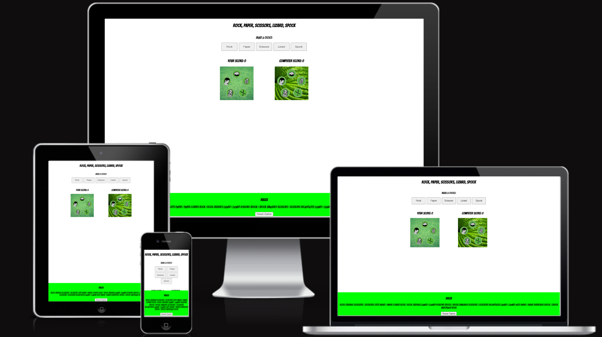
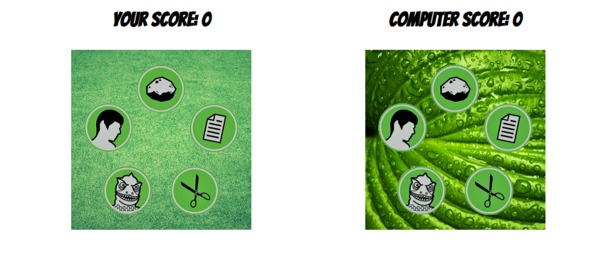
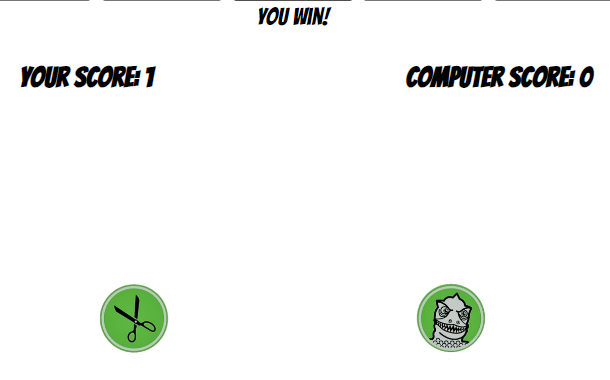

# ROCK PAPER SCISSORS LIZARD SPOCK GAME

  The ROCK PAPER SCISSORS LIZARD SPOCK game is a site that hopes to demonstrate how pure JavaScript works in a real-world context. The site will be targeted toward people who not only love to implement more advanced JavaScript concepts but also who love games. ROCK PAPER SCISSORS LIZARD SPOCK game is a fully responsive JavaScript game that will allow users to pick different options going up against the computer. It is made popular by the tv show "The Big Bang Theory". 

## Features 

### Existing Features

- __ROCK PAPER SCISSORS LIZARD SPOCK HEADING__

  - Featured at the top of the page, the ROCK PAPER SCISSORS LIZARD SPOCK heading is easy to see for the user. Upon viewing the page, the user will be able to see the name of the game.

- __The Game Area__

  - This section will allow the user to play the game. The user will be able to easily see icons and play by clicking on the icons for Rock, Paper, Scissors, Lizard, Spock.
   

- __The Score Area__

  - This section will allow the user to see exactly how many times they have won or lost and the same for the computer.
  - It also contains the icons for all the different options. The player and computer images both have the same symbols with different backgrounds.

- __The Results Area__

  - This section shows if the player has won or lost.
  - The icons chosen by the player and computer also are shown when chosen button is pressed.

- __The Rules Area__

  - This section explains the rules in detail i.e Rock Crushes Scissors
  - This section also includes a reset button if the player wants to start from scratch.
  

## Testing 

### Validator Testing 

- HTML
    - No errors were returned when passing through the official [W3C validator](https://validator.w3.org/nu/?showsource=yes&doc=https%3A%2F%2Fgithub.com%2FShaneJames89%2FProject2-Rock-Paper-Scissors-Lizard-Spock-Game.git#textarea)
- CSS
    - No errors were found when passing through the official [(Jigsaw) validator](https://jigsaw.w3.org/css-validator/validator)
- JavaScript
    - No errors were found when passing through the official [Jshint validator](https://jshint.com/)
      - There are 6 functions in this file.

      - Function with the largest signature take 2 arguments, while the median is 0.5.

      - Largest function has 13 statements in it, while the median is 4.5.

      - The most complex function has a cyclomatic complexity value of 17 while the median is 1.

### Unfixed Bugs

- All bugs have been fixed using tools such as validators and lighthouse. 

## Deployment 

- The site was deployed to GitHub pages. The steps to deploy are as follows: 
  - In the GitHub repository, navigate to the Settings tab 
  - From the source section drop-down menu, select the Master Branch
  - Once the master branch has been selected, the page will be automatically refreshed with a detailed ribbon display to indicate the successful deployment. 

The live link can be found here - https://shanejames89.github.io/Project2-Rock-Paper-Scissors-Lizard-Spock-Game/

## Credits 
### Content 

- I used chatgpt for some suggestions on site building but only used a small bit of the code suggested.
- The fonts used were taken from Google fonts.

### Media

- The icons used for the player and computer choice were taken from this music artist Geoffrey The Giant(https://open.spotify.com/album/5HUZ024Mz8PYadkfx5Dmz2)

